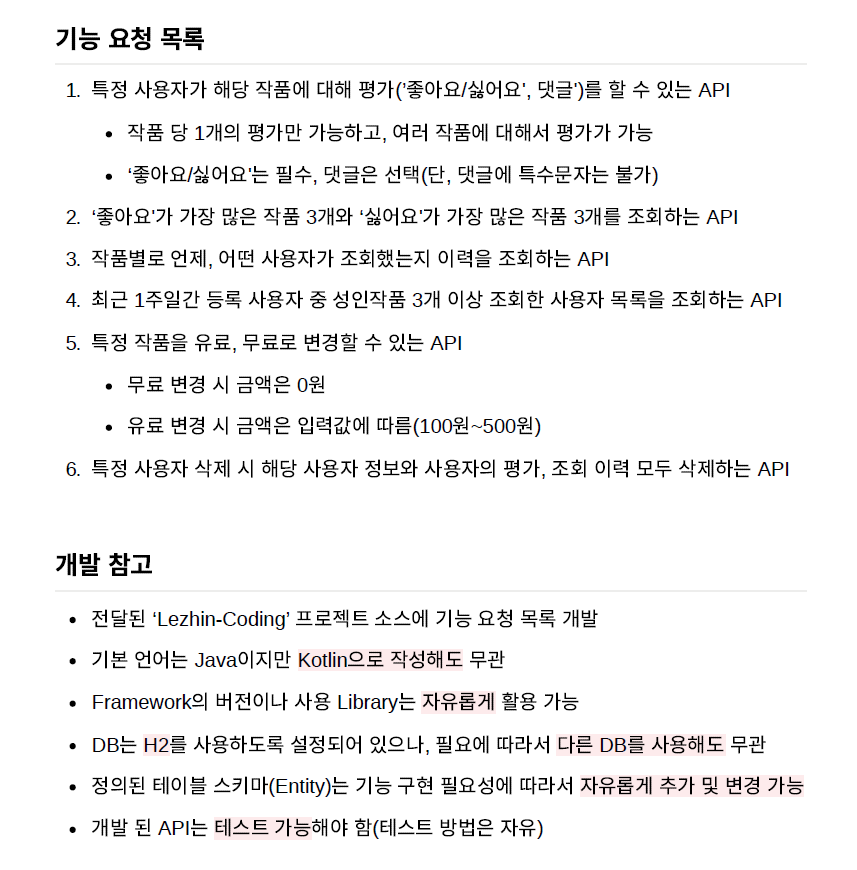

# Practice Project for Mission Preparation

This is a practice project created in preparation for a mission assignment. As the details of the assignment are not provided, certain parts of the project have been arbitrarily set up for practice.

## Overview

The project serves as a practice ground for mission preparation. Any questions or comments for improvement can be sent via email. Please note that if there are any copyright concerns with the problems found on the internet, the project can be made private.

## Project Structure

The mission details are unknown, so certain sections of the project have been set up arbitrarily.

<p align="center">
  
</p>

## Running the App

To run the app, use the following Docker Compose command:

```bash
$ docker-compose up
```

## Stay in touch

- Author - [hyunwoodo](hyunwoodo.dev@gmail.com)
- Portfolio - [https://hyunwoodo.dev]

## License

Nest is [MIT licensed](LICENSE).
